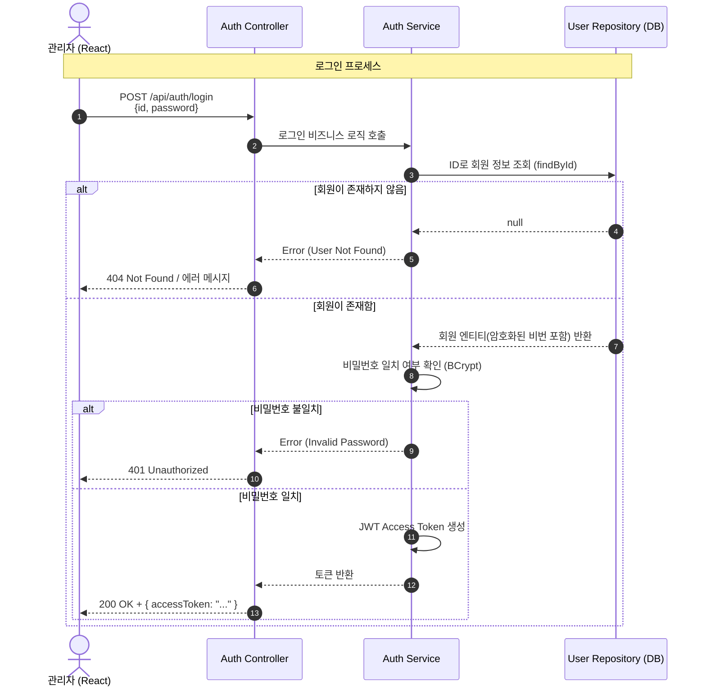
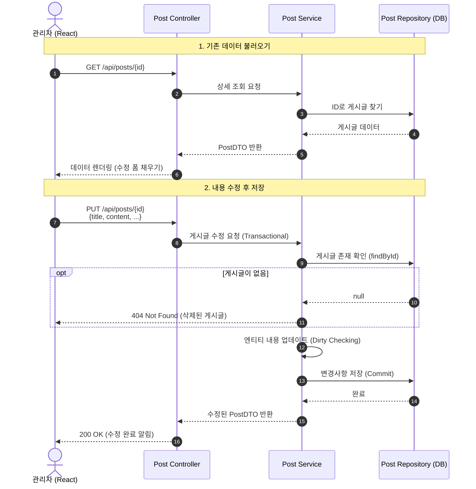
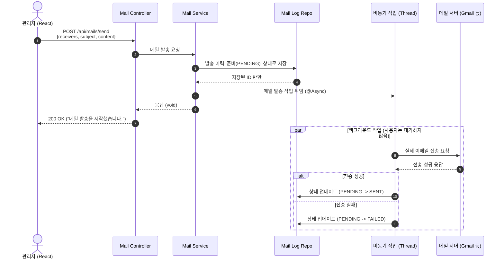
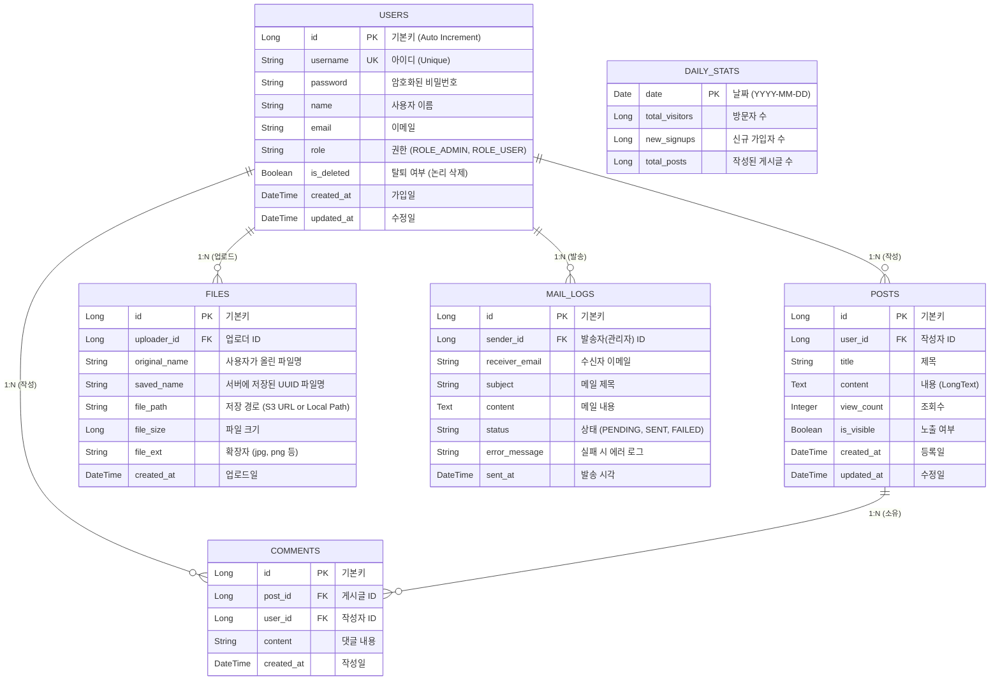

# AdminTemplate
관리자화면 초안 시나리오 구성 및 README 작성 테스트용
어떤 서비스를 만들 것인가 → 기본적인 관리자를 구성하고 싶음
1. 플로우차트 구성 : 전체적인 서비스 흐름 파악
2. 기능 명세 & 기술 스택 선정 : 무엇을 어떤 기술로 만들지 확정 ( Vite(React + TypeScript) / Java SpringBoot ) → 추후 Next.js(Express)
3. ERD설계 : 데이터 구조 잡기
4. API 명세서 작성 (보류)
5. 기능별 시나리오 구성 (Mermaid형식으로 기술)
6. UI / UX (Visily/Figma Make) : 화면 초안 그리기

```graph TD
    Start((관리자 접속)) --> Login[로그인 페이지]
    Login --> |인증 성공| Main[대시보드 메인]
    
    Main --> Menu1[사용자 관리]
    Menu1 --> Sub1_1[회원 목록/검색]
    Menu1 --> Sub1_2[회원 상세/수정]
    Menu1 --> Sub1_3[탈퇴 처리]

    Main --> Menu2[콘텐츠 관리]
    Menu2 --> Sub2_1[게시글 관리]
    Menu2 --> Sub2_2[댓글 관리]

    Main --> Menu3[파일 관리]
    Menu3 --> Sub3_1[업로드 파일 목록]
    Menu3 --> Sub3_2[미사용 파일 정리]

    Main --> Menu4[메일 관리]
    Menu4 --> Sub4_1[메일 발송]
    Menu4 --> Sub4_2[발송 이력 조회]

    Main --> Menu5[통계]
    Menu5 --> Sub5_1[방문자 통계]
    Menu5 --> Sub5_2[가입자 추이]
```

### 1.  사용자 관리 : 로그인 및 토큰 발급(JWT 인증) 시나리오



### 2. 컨텐츠 관리 시나리오

### 3. 메일 송신 관리 시나리오


## ERD



### DB구축(SQL)
```SQL
-- 1. 사용자 테이블 (Users)
CREATE TABLE users (
    id BIGINT AUTO_INCREMENT PRIMARY KEY COMMENT '기본키',
    username VARCHAR(50) NOT NULL UNIQUE COMMENT '로그인 아이디',
    password VARCHAR(255) NOT NULL COMMENT '암호화된 비밀번호',
    name VARCHAR(50) NOT NULL COMMENT '사용자 이름',
    email VARCHAR(100) NOT NULL COMMENT '이메일',
    role VARCHAR(20) NOT NULL DEFAULT 'ROLE_USER' COMMENT '권한',
    is_deleted BOOLEAN DEFAULT FALSE COMMENT '탈퇴 여부',
    created_at DATETIME DEFAULT CURRENT_TIMESTAMP COMMENT '가입일',
    updated_at DATETIME DEFAULT CURRENT_TIMESTAMP ON UPDATE CURRENT_TIMESTAMP COMMENT '수정일'
) ENGINE=InnoDB DEFAULT CHARSET=utf8mb4 COMMENT='사용자 정보';

-- 2. 게시글 테이블 (Posts)
CREATE TABLE posts (
    id BIGINT AUTO_INCREMENT PRIMARY KEY COMMENT '기본키',
    user_id BIGINT NOT NULL COMMENT '작성자 ID',
    title VARCHAR(200) NOT NULL COMMENT '제목',
    content LONGTEXT COMMENT '내용',
    view_count INT DEFAULT 0 COMMENT '조회수',
    is_visible BOOLEAN DEFAULT TRUE COMMENT '노출 여부',
    created_at DATETIME DEFAULT CURRENT_TIMESTAMP,
    updated_at DATETIME DEFAULT CURRENT_TIMESTAMP ON UPDATE CURRENT_TIMESTAMP,
    FOREIGN KEY (user_id) REFERENCES users(id)
) ENGINE=InnoDB DEFAULT CHARSET=utf8mb4 COMMENT='게시글';

-- 3. 댓글 테이블 (Comments)
CREATE TABLE comments (
    id BIGINT AUTO_INCREMENT PRIMARY KEY,
    post_id BIGINT NOT NULL COMMENT '게시글 ID',
    user_id BIGINT NOT NULL COMMENT '작성자 ID',
    content TEXT NOT NULL COMMENT '댓글 내용',
    created_at DATETIME DEFAULT CURRENT_TIMESTAMP,
    FOREIGN KEY (post_id) REFERENCES posts(id),
    FOREIGN KEY (user_id) REFERENCES users(id)
) ENGINE=InnoDB DEFAULT CHARSET=utf8mb4 COMMENT='댓글';

-- 4. 파일 테이블 (Files)
CREATE TABLE files (
    id BIGINT AUTO_INCREMENT PRIMARY KEY,
    uploader_id BIGINT NOT NULL COMMENT '업로더 ID',
    original_name VARCHAR(255) NOT NULL COMMENT '원본 파일명',
    saved_name VARCHAR(255) NOT NULL COMMENT '저장된 파일명(UUID)',
    file_path VARCHAR(500) NOT NULL COMMENT '파일 경로',
    file_size BIGINT NOT NULL COMMENT '파일 크기(Byte)',
    file_ext VARCHAR(10) NOT NULL COMMENT '확장자',
    created_at DATETIME DEFAULT CURRENT_TIMESTAMP,
    FOREIGN KEY (uploader_id) REFERENCES users(id)
) ENGINE=InnoDB DEFAULT CHARSET=utf8mb4 COMMENT='첨부파일';

-- 5. 메일 발송 로그 (MailLogs)
CREATE TABLE mail_logs (
    id BIGINT AUTO_INCREMENT PRIMARY KEY,
    sender_id BIGINT NOT NULL COMMENT '발송자 ID',
    receiver_email VARCHAR(100) NOT NULL COMMENT '수신자 이메일',
    subject VARCHAR(200) NOT NULL COMMENT '메일 제목',
    content TEXT COMMENT '메일 내용',
    status VARCHAR(20) DEFAULT 'PENDING' COMMENT '발송 상태(PENDING/SENT/FAILED)',
    error_message TEXT COMMENT '에러 메시지',
    sent_at DATETIME DEFAULT CURRENT_TIMESTAMP COMMENT '발송 시간',
    FOREIGN KEY (sender_id) REFERENCES users(id)
) ENGINE=InnoDB DEFAULT CHARSET=utf8mb4 COMMENT='메일 발송 이력';

-- 6. 일별 통계 (DailyStats)
CREATE TABLE daily_stats (
    date DATE PRIMARY KEY COMMENT '날짜(YYYY-MM-DD)',
    total_visitors BIGINT DEFAULT 0 COMMENT '총 방문자',
    new_signups BIGINT DEFAULT 0 COMMENT '신규 가입자',
    total_posts BIGINT DEFAULT 0 COMMENT '작성 게시글 수'
) ENGINE=InnoDB DEFAULT CHARSET=utf8mb4 COMMENT='일별 통계';
```
### API명세서

#### 인증/사용자(Auth & User)

| **Method** | **URI**           | **설명**      | **Request Body 예시**                          |
| ---------- | ----------------- | ----------- | -------------------------------------------- |
| **POST**   | `/api/auth/login` | 로그인 (토큰 발급) | `{ "username": "admin", "password": "123" }` |
| **POST**   | `/api/users`      | 회원가입/등록     | `{ "username": "test", "name": "김결휘", ... }` |
| **GET**    | `/api/users`      | 회원 목록 조회    | `?page=1&size=10` (쿼리 파라미터)                  |
| **PUT**    | `/api/users/{id}` | 회원 정보 수정    | `{ "name": "변경할이름", "email": "..." }`        |
#### 게시글
|**Method**|**URI**|**설명**|**Request Body 예시**|
|---|---|---|---|
|**GET**|`/api/posts`|게시글 목록 조회|`?keyword=검색어`|
|**GET**|`/api/posts/{id}`|게시글 상세 조회|-|
|**POST**|`/api/posts`|게시글 등록|`{ "title": "공지", "content": "내용", "userId": 1 }`|
|**PUT**|`/api/posts/{id}`|게시글 수정|`{ "title": "수정공지", "content": "수정내용" }`|
|**DELETE**|`/api/posts/{id}`|게시글 삭제|-|
#### 파일 및 메일
|**Method**|**URI**|**설명**|**Request Body 예시**|
|---|---|---|---|
|**POST**|`/api/files/upload`|파일 업로드|`Form-Data` 형식 (file 객체)|
|**GET**|`/api/files/{id}`|파일 다운로드|-|
|**POST**|`/api/mail/send`|메일 발송 요청|`{ "receiver": "user@abc.com", "subject": "..." }`|

### Spring Boot 프로젝트 폴더 구조
```tree
src/main/java/com/gyeolhwi/adminproject
│
├── global                  // # 프로젝트 공통 설정
│   ├── config              // (SecurityConfig, WebConfig 등 설정)
│   ├── error               // (GlobalExceptionHandler 등 에러 처리)
│   └── util                // (날짜 계산기 등 유틸 파일)
│
├── domain                  // # 핵심 기능 모음
│   ├── user                // 1. 사용자 관련
│   │   ├── controller      // (UserController)
│   │   ├── service         // (UserService)
│   │   ├── repository      // (UserRepository)
│   │   ├── entity          // (User Entity)
│   │   └── dto             // (LoginRequest, UserResponse 등)
│   │
│   ├── post                // 2. 게시글 관련
│   │   ├── controller
│   │   ├── service
│   │   ├── repository
│   │   ├── entity
│   │   └── dto
│   │
│   ├── file                // 3. 파일 관련
│   └── mail                // 4. 메일 관련
│
└── AdminProjectApplication.java  // 실행 파일
```
